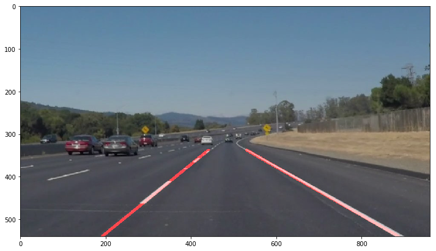
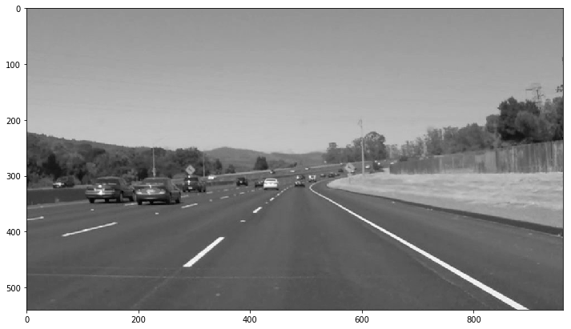
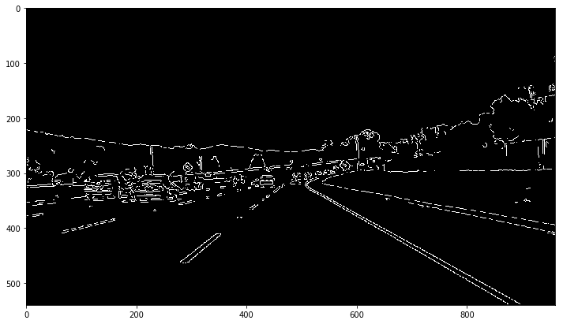
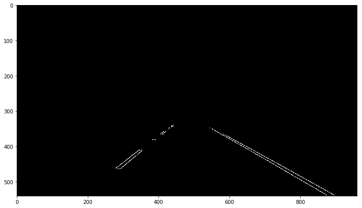
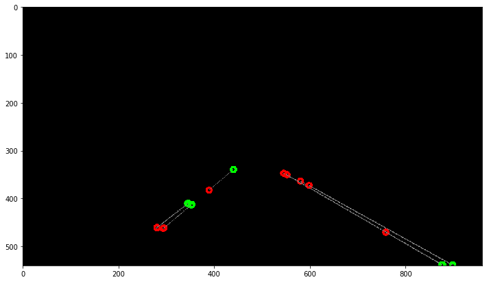

# Finding Lane Lines on the Road

Detecting lane lines is one of the vital parts of self driving cars especially for steering. 
In this project, i developed a pipeline to process a video file to find lane lines and save an annotated version of the video file. 

See it in action: 
- https://www.youtube.com/watch?v=3p0NY46IrX4
- https://www.youtube.com/watch?v=nUdMYyYEHX8
- https://www.youtube.com/watch?v=G77kZUnWgcc

#### Dependencies
- Python 3
- NumPy
- OpenCV
- Matplotlib
- MoviePy

### Pipeline

My pipeline consisted of 5 steps. 

1. First, image is converted to greyscale.

2. Gaussian blur is applied to suppress noise in the image.

3. Then, Canny edge detection is applied to find edges in the image. 

4. Region of interest, described as a rectangular area is cropped not to deal with irrelevant structures in the other parts of the image. 

5. Finally Hough transformation is applied and lines in the image is detected. 

#### Drawing lines

After finding lines in image, lines are filtered by slope. I filtered out lines which has a slope not falling in range [-0.5, 0.5]. 

I modified the `draw_lines()` method in a way that each detected and filtered line (showed in image above) is extrapolated to pass from bottom of the image and the top of the region of interest. Then top and bottom points of extrapolated lines are averaged to find one top and one bottom point for each left and right line. Then a single line is drawn between averaged points.

Also a moving window average mechanism is implemented to smooth drawing. Averaged points of lines are pushed into history array and then averaged for last points as window size. 

### Potential Shortcomings

One potential shortcoming would be if the lane line color and the color of the road were somehow close (in shadow or bad weather conditions), then Canny edge detector could fail to detect edges. Because, edges are detected at points which has high color gradients. 

Alos, my apporach fits first order lines to the averaged points, this make impossible to detect/draw lane lines which has curvature. 

### Possible Improvements

White and yellow colors can be filtered to extract lane lines but not shadows, cracs and other irrelevant stuff on the road. I extrapolated every line and then averaged edge points. For an improvement to my averaging approach, standart deviation of left and right line points can be computed and then outlier points can be detected and filtered.